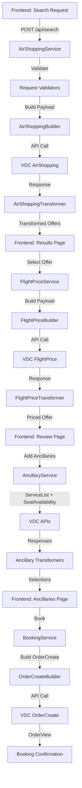

# REA Flight Portal - Backend Architecture

## Table of Contents
1. [Executive Summary](#executive-summary)
2. [Core Architecture Principles](#core-architecture-principles)
3. [Technology Stack](#technology-stack)
4. [System Design](#system-design)
5. [Service Layer Architecture](#service-layer-architecture)
6. [Data Flow & Processing](#data-flow--processing)
7. [API Endpoints Design](#api-endpoints-design)
8. [Error Handling & Validation](#error-handling--validation)
9. [Security & Authentication](#security--authentication)
10. [Performance & Scalability](#performance--scalability)
11. [Implementation Guide](#implementation-guide)

---

## Executive Summary

### Vision
Build a production-grade, maintainable, and scalable NDC-compliant flight booking backend that follows industry best practices, SOLID principles, and clean architecture patterns.

### Current State Problems
- **Bloated codebase**: 8,000+ lines with excessive duplication
- **Over-engineering**: Redis dependency, multiple cache layers, complex singleton patterns
- **Poor separation of concerns**: 1,976-line route files, mixed responsibilities
- **Maintenance burden**: 25+ dependencies, 6+ transformer files with duplicate logic

### Target Architecture Goals
- **Simplicity**: KISS principle, DRY, clear separation of concerns
- **Maintainability**: ~2,000-2,500 lines, modular design, single responsibility
- **Reliability**: Robust error handling, input validation, type safety
- **Scalability**: Stateless design, efficient resource usage
- **Standards compliance**: NDC/VDC specification adherence, Python PEP standards

---

## Core Architecture Principles

### 1. Clean Architecture
```
┌─────────────────────────────────────────┐
│         API Layer (FastAPI)             │
│  - Routes / Endpoints                   │
│  - Request/Response Models (Pydantic)   │
└──────────────┬──────────────────────────┘
               │
┌──────────────▼──────────────────────────┐
│         Service Layer                    │
│  - Business Logic                       │
│  - Workflow Orchestration               │
└──────────────┬──────────────────────────┘
               │
┌──────────────▼──────────────────────────┐
│         Integration Layer                │
│  - VDC API Client                       │
│  - Data Transformation                  │
└──────────────┬──────────────────────────┘
               │
┌──────────────▼──────────────────────────┐
│         Utility Layer                    │
│  - Validators                           │
│  - Helpers                              │
└─────────────────────────────────────────┘
```

### 2. SOLID Principles Application

**Single Responsibility Principle (SRP)**
- Each service handles ONE VDC API operation
- Transformers handle ONLY data mapping
- Validators handle ONLY input validation

**Open/Closed Principle (OCP)**
- Services extensible via configuration
- Transformers pluggable for different response formats
- Easy to add new airlines without modifying core logic

**Liskov Substitution Principle (LSP)**
- All VDC services implement common interface
- Transformers follow consistent contract

**Interface Segregation Principle (ISP)**
- Minimal, focused interfaces
- Clients depend only on methods they use

**Dependency Inversion Principle (DIP)**
- Depend on abstractions (protocols/interfaces)
- Concrete implementations injected via dependency injection

### 3. Design Patterns

**Factory Pattern** - For creating VDC request payloads
**Strategy Pattern** - For multi-airline vs single-airline handling
**Decorator Pattern** - For adding validation, logging, metrics
**Repository Pattern** - For session management (optional future state)

---

## Technology Stack

### Core Framework
```python
# FastAPI - Modern async web framework
from fastapi import FastAPI, HTTPException, Depends
from fastapi.middleware.cors import CORSMiddleware
from pydantic import BaseModel, Field, validator
```

### HTTP Client
```python
# httpx - Modern async HTTP client (replaces aiohttp)
import httpx
```

### Validation & Type Safety
```python
# Pydantic v2 - Data validation using type hints
from pydantic import BaseModel, Field, ConfigDict
from typing import Optional, List, Dict, Literal
```

### Environment Management
```python
# python-dotenv - Environment variable management
from dotenv import load_dotenv
import os
```

### Dependencies (Minimal Set)
```txt
fastapi>=0.104.0
httpx>=0.25.0
pydantic>=2.5.0
python-dotenv>=1.0.0
uvicorn[standard]>=0.24.0
pydantic-settings>=2.1.0
python-multipart>=0.0.6
```

---

## System Design

### Directory Structure
```
Backend/
├── app/
│   ├── __init__.py
│   ├── main.py                    # FastAPI application entry point
│   ├── config.py                  # Configuration management
│   │
│   ├── core/                      # Core infrastructure
│   │   ├── __init__.py
│   │   ├── auth.py               # VDC OAuth2 authentication
│   │   ├── http_client.py        # Centralized HTTP client
│   │   ├── exceptions.py         # Custom exception hierarchy
│   │   └── dependencies.py       # FastAPI dependencies
│   │
│   ├── models/                    # Pydantic models
│   │   ├── __init__.py
│   │   ├── requests/             # Request models
│   │   │   ├── air_shopping.py
│   │   │   ├── flight_price.py
│   │   │   ├── service_list.py
│   │   │   ├── seat_availability.py
│   │   │   └── order_create.py
│   │   │
│   │   ├── responses/            # Response models
│   │   │   ├── air_shopping.py
│   │   │   ├── flight_price.py
│   │   │   ├── service_list.py
│   │   │   ├── seat_availability.py
│   │   │   └── order_create.py
│   │   │
│   │   └── common.py            # Shared models
│   │
│   ├── services/                 # Business logic
│   │   ├── __init__.py
│   │   ├── base.py              # Base service class
│   │   ├── air_shopping.py      # AirShopping workflow
│   │   ├── flight_price.py      # FlightPrice workflow
│   │   ├── ancillary.py         # ServiceList + SeatAvailability
│   │   └── booking.py           # OrderCreate workflow
│   │
│   ├── builders/                # Request payload builders
│   │   ├── __init__.py
│   │   ├── air_shopping.py
│   │   ├── flight_price.py
│   │   ├── service_list.py
│   │   ├── seat_availability.py
│   │   └── order_create.py
│   │
│   ├── transformers/            # Response transformers
│   │   ├── __init__.py
│   │   ├── base.py
│   │   ├── air_shopping.py
│   │   ├── flight_price.py
│   │   ├── ancillary.py
│   │   └── booking.py
│   │
│   ├── validators/              # Input validation
│   │   ├── __init__.py
│   │   ├── travel_dates.py
│   │   ├── passengers.py
│   │   └── payment.py
│   │
│   ├── routes/                  # API endpoints
│   │   ├── __init__.py
│   │   ├── search.py           # Search endpoints
│   │   ├── booking.py          # Booking endpoints
│   │   └── health.py           # Health check
│   │
│   └── utils/                   # Helper utilities
│       ├── __init__.py
│       ├── logger.py
│       ├── constants.py
│       └── helpers.py
│
├── tests/                       # Test suite
│   ├── __init__.py
│   ├── conftest.py
│   ├── unit/
│   ├── integration/
│   └── fixtures/
│
├── .env.example                 # Environment template
├── .gitignore
├── README.md
└── requirements.txt
```

---

## Service Layer Architecture

### Base Service Pattern
```python
# app/services/base.py
from abc import ABC, abstractmethod
from typing import Dict, Any
import httpx
from app.core.auth import VDCAuthClient
from app.core.http_client import get_http_client
from app.core.exceptions import VDCAPIError

class BaseVDCService(ABC):
    """
    Base class for all VDC API services.
    
    Provides:
    - Authentication handling
    - HTTP client management
    - Common error handling
    - Logging infrastructure
    """
    
    def __init__(
        self, 
        auth_client: VDCAuthClient,
        http_client: httpx.AsyncClient
    ):
        self.auth = auth_client
        self.http = http_client
        self.api_url = "https://api.stage.verteil.com/entrygate/rest/request"
    
    async def _make_request(
        self, 
        service_name: str,
        payload: Dict[str, Any],
        headers: Optional[Dict[str, str]] = None
    ) -> Dict[str, Any]:
        """
        Make authenticated request to VDC API.
        
        Args:
            service_name: VDC service name (e.g., 'AirShopping')
            payload: Request payload
            headers: Optional additional headers
            
        Returns:
            API response dict
            
        Raises:
            VDCAPIError: On API errors
        """
        # Get authentication token
        token = await self.auth.get_token()
        
        # Build headers
        request_headers = {
            "Authorization": f"Bearer {token}",
            "Content-Type": "application/json",
            "Accept": "application/json",
            "Accept-Encoding": "gzip",
            "Service": service_name,
            "OfficeId": self.auth.office_id,
            **(headers or {})
        }
        
        # Make request
        try:
            response = await self.http.post(
                f"{self.api_url}:{service_name}",
                json=payload,
                headers=request_headers,
                timeout=30.0
            )
            response.raise_for_status()
            return response.json()
            
        except httpx.HTTPStatusError as e:
            raise VDCAPIError(
                f"VDC API error: {e.response.status_code}",
                status_code=e.response.status_code,
                response=e.response.json() if e.response.text else None
            )
        except httpx.RequestError as e:
            raise VDCAPIError(f"Request failed: {str(e)}")
    
    @abstractmethod
    async def execute(self, **kwargs) -> Dict[str, Any]:
        """Execute the service workflow."""
        pass
```

### AirShopping Service Implementation
```python
# app/services/air_shopping.py
from typing import Dict, Any, List
from app.services.base import BaseVDCService
from app.builders.air_shopping import AirShoppingRequestBuilder
from app.transformers.air_shopping import AirShoppingTransformer
from app.models.requests.air_shopping import AirShoppingRequest
from app.validators.travel_dates import validate_travel_dates

class AirShoppingService(BaseVDCService):
    """
    Handles flight search workflow.
    
    Workflow:
    1. Validate input
    2. Build VDC request
    3. Call AirShopping API
    4. Transform response
    """
    
    async def execute(
        self,
        request: AirShoppingRequest
    ) -> Dict[str, Any]:
        """
        Execute flight search.
        
        Args:
            request: Validated search request
            
        Returns:
            Transformed flight offers
        """
        # Validate travel dates
        validate_travel_dates(request.segments)
        
        # Build VDC payload
        builder = AirShoppingRequestBuilder()
        vdc_payload = builder.build(
            segments=request.segments,
            passengers=request.passengers,
            cabin_class=request.cabin_class,
            preferences=request.preferences
        )
        
        # Call VDC API
        raw_response = await self._make_request(
            service_name="AirShopping",
            payload=vdc_payload
        )
        
        # Transform response
        transformer = AirShoppingTransformer()
        transformed = transformer.transform(
            response=raw_response,
            search_context=request.dict()
        )
        
        return {
            "offers": transformed["offers"],
            "metadata": transformed["metadata"],
            "raw_response": raw_response  # For subsequent FlightPrice calls
        }
```

### FlightPrice Service Implementation
```python
# app/services/flight_price.py
from typing import Dict, Any
from app.services.base import BaseVDCService
from app.builders.flight_price import FlightPriceRequestBuilder
from app.transformers.flight_price import FlightPriceTransformer

class FlightPriceService(BaseVDCService):
    """
    Handles offer pricing workflow.
    
    Workflow:
    1. Extract offer from AirShoppingRS
    2. Build FlightPrice request
    3. Call FlightPrice API
    4. Transform and validate pricing
    """
    
    async def execute(
        self,
        air_shopping_response: Dict[str, Any],
        offer_index: int,
        airline_owner: Optional[str] = None
    ) -> Dict[str, Any]:
        """
        Get pricing for selected offer.
        
        Args:
            air_shopping_response: Raw AirShopping response
            offer_index: Selected offer index
            airline_owner: Optional airline code for multi-airline responses
            
        Returns:
            Priced offer with full details
        """
        # Build VDC payload
        builder = FlightPriceRequestBuilder()
        vdc_payload = builder.build(
            air_shopping_response=air_shopping_response,
            selected_offer_index=offer_index,
            selected_airline_owner=airline_owner
        )
        
        # Call VDC API
        raw_response = await self._make_request(
            service_name="FlightPrice",
            payload=vdc_payload
        )
        
        # Transform response
        transformer = FlightPriceTransformer()
        transformed = transformer.transform(
            response=raw_response
        )
        
        return {
            "priced_offer": transformed["offer"],
            "pricing_details": transformed["pricing"],
            "raw_response": raw_response  # For OrderCreate
        }
```

---

## Data Flow & Processing

### Flight Search & Booking Flow



### Critical Data Mapping (VDC Spec Compliance)

**AirShopping → FlightPrice**
```python
# Extract references per VDC spec
mapping = {
    "OfferID.value": "Query.Offers.Offer.OfferID.value",
    "OfferID.Owner": "Query.Offers.Offer.OfferID.Owner",
    "OfferItemID": "Query.Offers.Offer.OfferItemIDs.OfferItemID.value",
    "ShoppingResponseID": "ShoppingResponseID.ResponseID.value",
    "SegmentKey": "Query.OriginDestination.Flight.SegmentKey",
    "TravelerReferences": "Query.Offers.Offer.OfferItemIDs.OfferItemID.refs"
}
```

**FlightPrice → OrderCreate**
```python
# Map priced offer per VDC spec
mapping = {
    "OfferItemID": "Query.OrderItems.ShoppingResponse.Offers.Offer.OfferItems.OfferItem.OfferItemID.value",
    "PriceDetail": "Query.OrderItems.OfferItem.OfferItemType.DetailedFlightItem.Price",
    "FlightSegments": "Query.OrderItems.OfferItem.OfferItemType.DetailedFlightItem.OriginDestination.Flight",
    "FareComponents": "Query.DataLists.FareList.FareGroup"
}
```

**ServiceList/SeatAvailability → OrderCreate**
```python
# Ancillary integration per VDC spec
service_mapping = {
    "Service.ObjectKey": "Query.OrderItems.OfferItem.OfferItemID.value",
    "Service.Price": "Query.OrderItems.OfferItem.OfferItemType.OtherItem.Price",
    "Service.Associations": "Query.DataLists.ServiceList.Service.Associations"
}

seat_mapping = {
    "Seat.ObjectKey": "Query.OrderItems.OfferItem.OfferItemID.value",
    "Seat.Location": "Query.OrderItems.OfferItem.OfferItemType.SeatItem.Location",
    "Seat.Price": "Query.OrderItems.OfferItem.OfferItemType.SeatItem.Price"
}
```

---

## API Endpoints Design

### Search Endpoints
```python
# app/routes/search.py
from fastapi import APIRouter, Depends, HTTPException
from typing import Dict, Any
from app.models.requests.air_shopping import AirShoppingRequest
from app.services.air_shopping import AirShoppingService
from app.core.dependencies import get_air_shopping_service

router = APIRouter(prefix="/api/search", tags=["search"])

@router.post("/flights")
async def search_flights(
    request: AirShoppingRequest,
    service: AirShoppingService = Depends(get_air_shopping_service)
) -> Dict[str, Any]:
    """
    Search for flights.
    
    Request body:
    - segments: List of origin-destination segments
    - passengers: Passenger counts by type
    - cabin_class: Preferred cabin class
    - preferences: Search preferences
    
    Returns:
    - offers: List of flight offers
    - metadata: Search metadata
    """
    try:
        result = await service.execute(request=request)
        return result
    except ValueError as e:
        raise HTTPException(status_code=400, detail=str(e))
    except Exception as e:
        raise HTTPException(status_code=500, detail="Search failed")

@router.post("/price")
async def price_offer(
    air_shopping_response: Dict[str, Any],
    offer_index: int,
    airline_owner: Optional[str] = None,
    service: FlightPriceService = Depends(get_flight_price_service)
) -> Dict[str, Any]:
    """
    Get pricing for selected offer.
    
    Request body:
    - air_shopping_response: Raw AirShopping response
    - offer_index: Index of selected offer
    - airline_owner: Optional airline code
    
    Returns:
    - priced_offer: Offer with full pricing
    - pricing_details: Price breakdown
    """
    try:
        result = await service.execute(
            air_shopping_response=air_shopping_response,
            offer_index=offer_index,
            airline_owner=airline_owner
        )
        return result
    except ValueError as e:
        raise HTTPException(status_code=400, detail=str(e))
    except Exception as e:
        raise HTTPException(status_code=500, detail="Pricing failed")
```

### Booking Endpoints
```python
# app/routes/booking.py
from fastapi import APIRouter, Depends, HTTPException
from typing import Dict, Any
from app.models.requests.order_create import OrderCreateRequest
from app.services.booking import BookingService
from app.core.dependencies import get_booking_service

router = APIRouter(prefix="/api/booking", tags=["booking"])

@router.post("/ancillaries/services")
async def get_services(
    flight_price_response: Dict[str, Any],
    service: AncillaryService = Depends(get_ancillary_service)
) -> Dict[str, Any]:
    """
    Get available ancillary services.
    
    Request body:
    - flight_price_response: Raw FlightPrice response
    
    Returns:
    - services: List of available services (meals, baggage, etc.)
    """
    result = await service.get_services(
        flight_price_response=flight_price_response
    )
    return result

@router.post("/ancillaries/seats")
async def get_seat_map(
    flight_price_response: Dict[str, Any],
    service: AncillaryService = Depends(get_ancillary_service)
) -> Dict[str, Any]:
    """
    Get seat availability map.
    
    Request body:
    - flight_price_response: Raw FlightPrice response
    
    Returns:
    - seat_map: Available seats per segment
    """
    result = await service.get_seats(
        flight_price_response=flight_price_response
    )
    return result

@router.post("/create")
async def create_booking(
    request: OrderCreateRequest,
    service: BookingService = Depends(get_booking_service)
) -> Dict[str, Any]:
    """
    Create booking.
    
    Request body:
    - flight_price_response: Raw FlightPrice response
    - passengers: Passenger details
    - payment: Payment information
    - selected_services: Optional service selections
    - selected_seats: Optional seat selections
    
    Returns:
    - booking: Created booking with PNR
    - tickets: E-ticket details
    """
    try:
        result = await service.execute(request=request)
        return result
    except ValueError as e:
        raise HTTPException(status_code=400, detail=str(e))
    except Exception as e:
        raise HTTPException(status_code=500, detail="Booking failed")
```

---

## Error Handling & Validation

### Exception Hierarchy
```python
# app/core/exceptions.py
class FlightPortalError(Exception):
    """Base exception for all application errors."""
    pass

class VDCAPIError(FlightPortalError):
    """VDC API related errors."""
    def __init__(self, message: str, status_code: int = 500, response: Any = None):
        self.message = message
        self.status_code = status_code
        self.response = response
        super().__init__(self.message)

class ValidationError(FlightPortalError):
    """Input validation errors."""
    pass

class AuthenticationError(FlightPortalError):
    """Authentication/authorization errors."""
    pass

class BusinessLogicError(FlightPortalError):
    """Business rule violations."""
    pass
```

### Request Validation
```python
# app/models/requests/air_shopping.py
from pydantic import BaseModel, Field, field_validator
from typing import List, Literal
from datetime import date

class FlightSegment(BaseModel):
    """Flight segment model."""
    origin: str = Field(..., min_length=3, max_length=3)
    destination: str = Field(..., min_length=3, max_length=3)
    departure_date: date
    
    @field_validator('origin', 'destination')
    @classmethod
    def validate_airport_code(cls, v: str) -> str:
        if not v.isupper():
            raise ValueError('Airport code must be uppercase')
        return v

class PassengerCounts(BaseModel):
    """Passenger counts model."""
    adults: int = Field(ge=1, le=9)
    children: int = Field(ge=0, le=9, default=0)
    infants: int = Field(ge=0, le=9, default=0)
    
    @field_validator('infants')
    @classmethod
    def validate_infants(cls, v: int, values) -> int:
        if 'adults' in values and v > values['adults']:
            raise ValueError('Infants cannot exceed adults')
        return v

class AirShoppingRequest(BaseModel):
    """Air shopping request model."""
    segments: List[FlightSegment] = Field(..., min_length=1, max_length=5)
    passengers: PassengerCounts
    cabin_class: Literal["Y", "C", "F", "W"] = "Y"
    preferences: Optional[Dict[str, Any]] = None
    
    model_config = ConfigDict(
        json_schema_extra={
            "example": {
                "segments": [
                    {"origin": "LHR", "destination": "DXB", "departure_date": "2025-06-01"}
                ],
                "passengers": {"adults": 2, "children": 1, "infants": 1},
                "cabin_class": "Y"
            }
        }
    )
```

---

## Security & Authentication

### OAuth2 Token Management (Simplified)
```python
# app/core/auth.py
import httpx
from datetime import datetime, timedelta
from typing import Optional
import os

class VDCAuthClient:
    """
    Simplified VDC OAuth2 authentication client.
    
    Features:
    - Token caching with automatic refresh
    - No disk persistence (stateless)
    - Thread-safe using async locks
    """
    
    def __init__(self):
        self.username = os.getenv("VDC_USERNAME")
        self.password = os.getenv("VDC_PASSWORD")
        self.office_id = os.getenv("VDC_OFFICE_ID")
        self.token_url = os.getenv("VDC_TOKEN_URL")
        
        self._token: Optional[str] = None
        self._token_expires_at: Optional[datetime] = None
        self._refresh_buffer = 300  # Refresh 5 min before expiry
    
    async def get_token(self) -> str:
        """
        Get valid access token.
        
        Returns:
            Valid access token
        """
        # Check if token is still valid
        if self._token and self._token_expires_at:
            if datetime.now() < (self._token_expires_at - timedelta(seconds=self._refresh_buffer)):
                return self._token
        
        # Request new token
        await self._refresh_token()
        return self._token
    
    async def _refresh_token(self):
        """Request new access token from VDC."""
        async with httpx.AsyncClient() as client:
            response = await client.post(
                self.token_url,
                auth=(self.username, self.password),
                data={"grant_type": "client_credentials", "scope": "api"}
            )
            response.raise_for_status()
            
            data = response.json()
            self._token = data["access_token"]
            expires_in = data.get("expires_in", 39600)  # Default 11 hours
            self._token_expires_at = datetime.now() + timedelta(seconds=expires_in)
```

---

## Performance & Scalability

### Design for Stateless Operation
- **No Redis**: Frontend manages session state
- **No file I/O**: Token caching in memory only
- **Connection pooling**: httpx client with connection limits
- **Async throughout**: All I/O operations async

### Resource Management
```python
# app/core/http_client.py
import httpx
from contextlib import asynccontextmanager

# Global HTTP client (reuse connections)
_http_client: Optional[httpx.AsyncClient] = None

def get_http_client() -> httpx.AsyncClient:
    """Get shared HTTP client instance."""
    global _http_client
    if _http_client is None:
        _http_client = httpx.AsyncClient(
            timeout=30.0,
            limits=httpx.Limits(
                max_connections=100,
                max_keepalive_connections=20
            )
        )
    return _http_client

@asynccontextmanager
async def lifespan(app: FastAPI):
    """Application lifespan manager."""
    # Startup
    global _http_client
    _http_client = get_http_client()
    yield
    # Shutdown
    if _http_client:
        await _http_client.aclose()
```

---

## Implementation Guide

### Phase 1: Foundation (Day 1)
```bash
# 1. Setup project structure
mkdir -p app/{core,models,services,builders,transformers,validators,routes,utils}

# 2. Install dependencies
pip install -r requirements.txt

# 3. Implement core infrastructure
- app/main.py
- app/config.py
- app/core/auth.py
- app/core/http_client.py
- app/core/exceptions.py

# 4. Create health check endpoint
- app/routes/health.py

# 5. Test basic setup
uvicorn app.main:app --reload
```

### Phase 2: Search Flow (Day 2)
```bash
# 1. Implement AirShopping
- app/models/requests/air_shopping.py
- app/builders/air_shopping.py
- app/transformers/air_shopping.py
- app/services/air_shopping.py
- app/routes/search.py (POST /api/search/flights)

# 2. Implement FlightPrice
- app/models/requests/flight_price.py
- app/builders/flight_price.py
- app/transformers/flight_price.py
- app/services/flight_price.py
- app/routes/search.py (POST /api/search/price)

# 3. Test search flow end-to-end
```

### Phase 3: Booking Flow (Day 3)
```bash
# 1. Implement Ancillary services
- app/builders/service_list.py
- app/builders/seat_availability.py
- app/transformers/ancillary.py
- app/services/ancillary.py
- app/routes/booking.py (POST /api/booking/ancillaries/*)

# 2. Implement OrderCreate
- app/models/requests/order_create.py
- app/builders/order_create.py
- app/transformers/booking.py
- app/services/booking.py
- app/routes/booking.py (POST /api/booking/create)

# 3. Test booking flow end-to-end
```

### Phase 4: Testing & Validation (Day 4)
```bash
# 1. Unit tests
- tests/unit/test_builders.py
- tests/unit/test_transformers.py
- tests/unit/test_validators.py

# 2. Integration tests
- tests/integration/test_search_flow.py
- tests/integration/test_booking_flow.py

# 3. Run full test suite
pytest tests/ -v --cov=app
```

### Phase 5: Documentation & Deployment (Day 5)
```bash
# 1. Generate API docs (auto from FastAPI)
# Access at http://localhost:8000/docs

# 2. Deployment configuration
- Dockerfile
- docker-compose.yml
- Render/cloud platform config

# 3. Environment setup guide
- .env.example
- README.md updates
```

---

## Key Metrics & Success Criteria

### Code Quality
- **Total Lines**: < 2,500
- **Average Function Length**: < 30 lines
- **Cyclomatic Complexity**: < 10
- **Test Coverage**: > 80%

### Performance
- **Search Response Time**: < 3s (P95)
- **Booking Response Time**: < 5s (P95)
- **Concurrent Requests**: 50+ simultaneous users

### Reliability
- **Error Rate**: < 1%
- **API Success Rate**: > 99%
- **Uptime**: > 99.9%

---

## Conclusion

This architecture provides a **clean, maintainable, and scalable** foundation for the REA Flight Portal backend. By following **SOLID principles**, **clean architecture**, and **VDC specification compliance**, we eliminate the bloat and over-engineering of the current system while maintaining full functionality and reliability.

**Next Steps**:
1. Review and approve architecture
2. Begin Phase 1 implementation
3. Iterative development with continuous testing
4. Deploy to production

---

*Document Version: 1.0*  
*Created: 2025-01-27*  
*Author: Senior Solution Architect*
